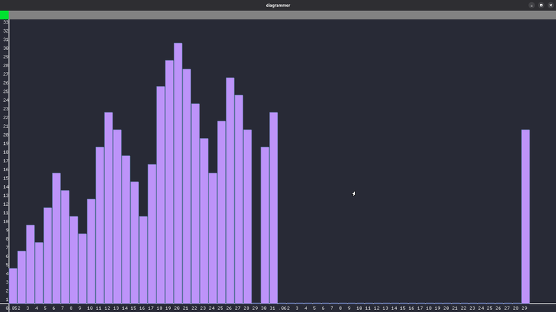
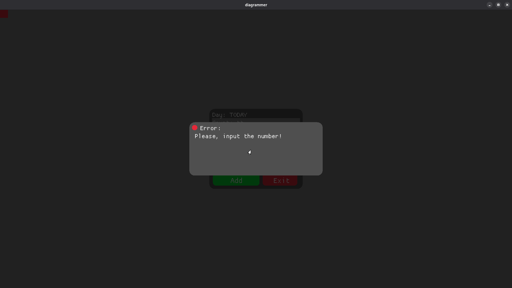
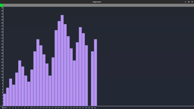

## 📸 Screenshots





## 🎥 Demo


# Diagrammer

**A simple diagram visualization tool built with Rust and Macroquad.**

---

## ✨ Features

- Add data with a custom count and comment
- View data as a bar chart
- Toggle grid on/off
- Save and load data using RON format
- Resize chart spacing
- Basic error handling with popups

---

## 🛠️ Technologies

- **Rust** — core language
- **Macroquad** — graphics and GUI
- **Serde + Ron** — serialization and storage
- **Chrono** — date handling

---

## 🚀 Getting Started

### Requirements

- Rust (latest stable)
- Cargo

### Run

```bash
git clone https://github.com/Lucik90/diagrammer.git
cd diagrammer
cargo run
